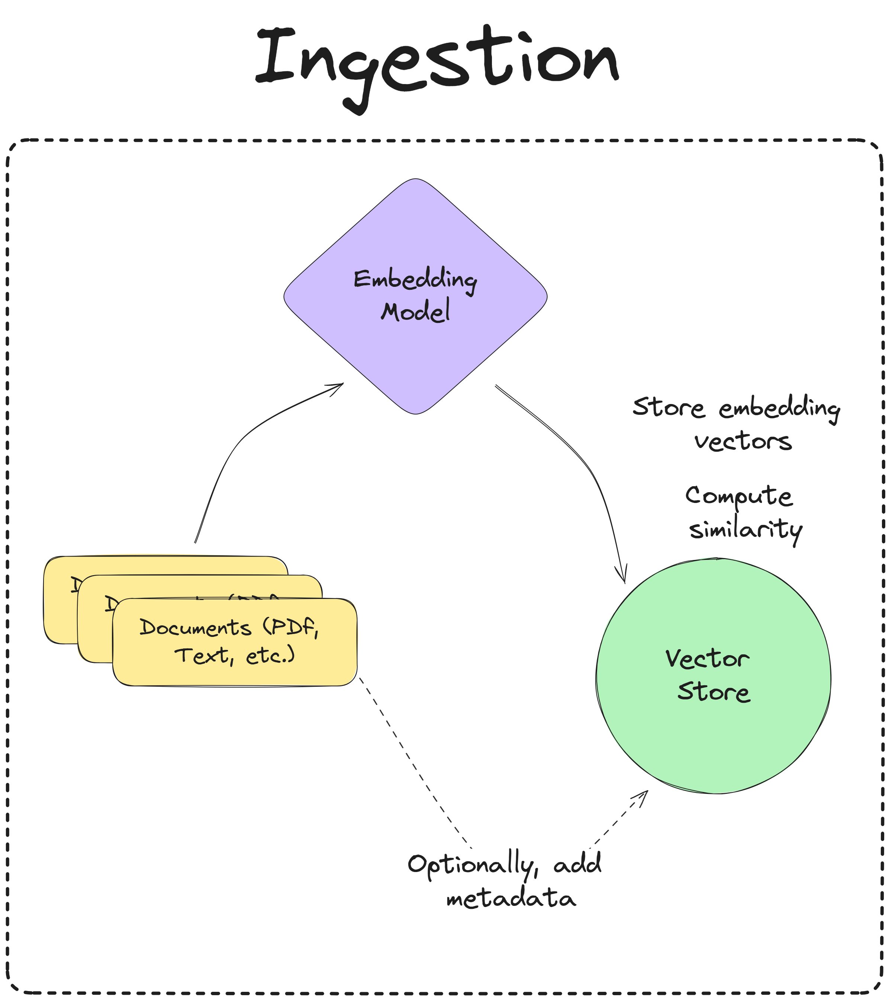
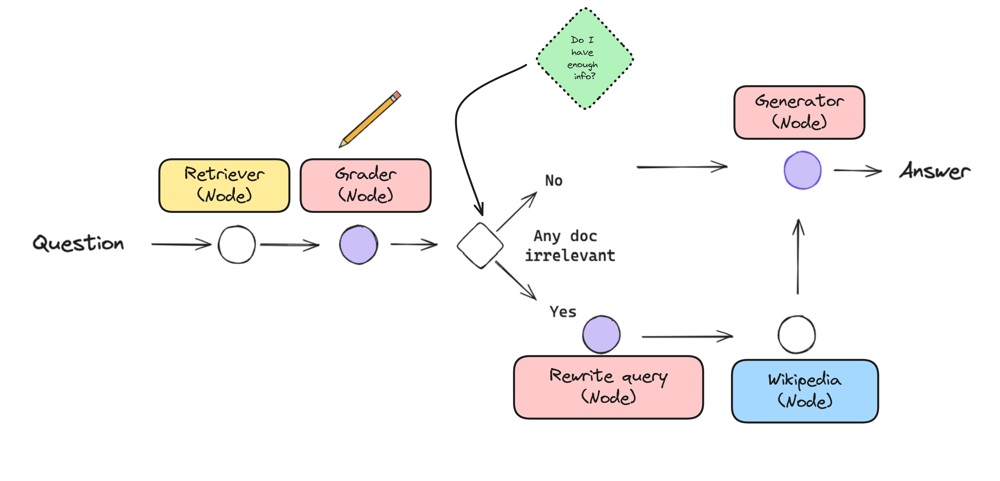
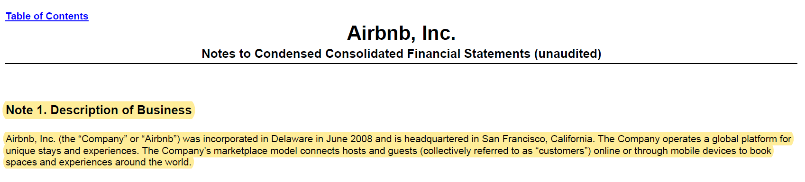
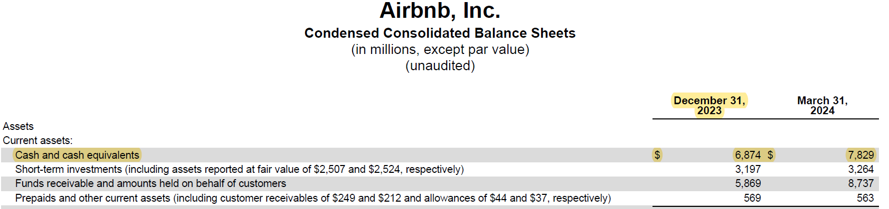

This chatbot is designed to answer questions about Airbnb's 10-Q financial statement for the quarter ended March 31, 2024.

It uses corrective RAG as the architecture to retrieve information based on the user's input, grading the relevance of the retrieved documents, and optionally querying Wikipedia for additional information, if necessary.

## Specifications

- Model type can be configured inside `utils/config.py` file. Default is set to `gpt-4o`.
- Vector store is set to `qdrant` (locally on disk) by default. The data directory and collection name can be configured in the `utils/config.py` file.
- Chainlit is used as the UI for the chatbot.
- The chatbot is deployed using Docker on HuggingFace Spaces.
- `LangChain` is used as the infrastructure and framework for the chatbot.
- `LangGraph` is used to compose the chatbot's flow.

## Flow engineering

### Ingestion

<!-- markdownlint-disable-next-line MD033 -->

The ingestion pipeline takes in documents, converts them into embeddings and stores them in a vectorstore to be used for retrieval.

### Question Answering

To perform Q/A, the chatbot uses a corrective RAG architecture, which is a strategy that involves self-reflection on retrieved documents. The flow is as follows:

The user provides a question, then:

1. The query is sent to the vector store to retrieve the most relevant documents. This is done through the `retriever` node.
2. The `grader` node receives the question and the retrieved documents and assigns a binary relevance score to each document with reasoning. This leads to filtering out irrelevant documents in the state and toggling the `wikipedia` node, both of which will be used in the next junction.
3. Based on the logic defined in the conditional edge, the chatbot will either: decide to generate an answer from the retrieved documents, or rewrite the user's question and query Wikipedia for additional information.
4. The `rewriter` node rewrites the question with semantic intent and sends it to the `wikipedia` node and updates the state with the rewritten question.
5. The `wikipedia` node queries Wikipedia for additional information based on the rewritten question and updates the state with new documents.
6. The `generate` node generates an answer based on the retrieved documents and the original / rewritten question and sends it to the user.

## Sample traces

### Trace 1

- Question: "What is Airbnb's 'Description of Business'?"
- Trace: [LangSmith](https://smith.langchain.com/public/74905526-a026-4a51-8e98-280ec53b8d91/r)
- Ground Truth: 

### Trace 2

- Question: "What was the total value of 'Cash and cash equivalents' as of December 31, 2023?"
- Trace: [LangSmith](https://smith.langchain.com/public/aa4ec48d-1028-492b-b1cd-c8896b815d1b/r)
- Ground Truth: 

### Trace 3

- Question: "What is the 'maximum number of shares to be sold under the 10b5-1 Trading plan' by Brian Chesky?"
- Trace: [LangSmith](https://smith.langchain.com/public/17d7d3f2-0c32-4ffe-85dd-8d5a2ea8a184/r)
- Ground Truth: 

## Configuration

### Prompts

Prompts for each model can be configured in the `utils/prompts.py` file.

### Models

Models can be configured in the `utils/config.py` file.

### Vectorstore

The vectorstore can be changed in the `nodes/retriever.py` file. Note that the default vectorstore is set to `qdrant` and persists locally on disk. Ideally, this should be changed to a remote vectorstore for production.

### Chains

Individual node chains can be configured in the `nodes` directory.

### UI

Chainlit is used as the UI for the chatbot. The UI can be configured in the `app.py` file.

### Server Configuration

A sample FastAPI server is provided in the `server.py` file. Note that this uses [LangServe](https://python.langchain.com/v0.2/docs/langserve/)

## TODO

- [ ] Implement memory in the chatbot
